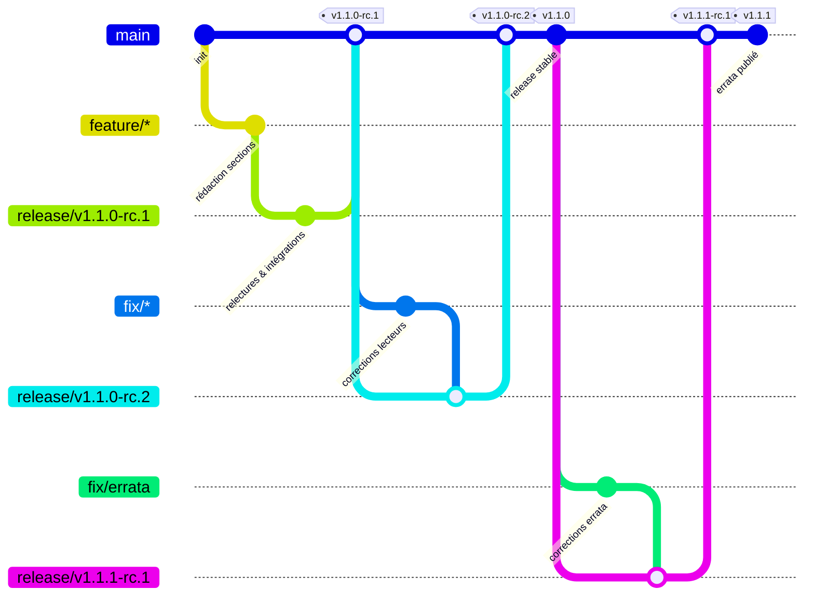

# 👥 Comment contribuer au projet

Merci de votre intérêt pour **Théorie de la mesure et systèmes dynamiques** !
Ce document explique comment participer efficacement au projet.

---
## 📋 Sommaire
- [Avant de commencer](#-avant-de-commencer)
- [Utiliser les templates](#%EF%B8%8F-utiliser-les-templates)
- [Processus de contribution](#-processus-de-contribution)
- [Règles LaTeX](#-règles-latex)
- [Conventions de nommage](#-conventions-de-nommage)
- [Relecture et validation](#-relecture-et-validation)
- [Licence](#-licence)

---
## 📝 Avant de commencer

1. Lisez le [`README.md`](README.md)
2. Consultez les **[Milestones](https://github.com/hervetchoffo/measure-dynamics-test/milestones)** en cours
3. Vérifiez qu’il n’existe pas déjà une issue pour votre idée

---
## 🛠️ Utiliser les templates

Nous utilisons des templates structurés pour garder le projet organisé :

- **Milestone** → `.github/MILESTONE_TEMPLATE.md`
- **Rédaction / Relecture / Correction** → `.github/ISSUE_TEMPLATE/`
- **Pull Request** → `.github/PULL_REQUEST_TEMPLATE.md`

**Toujours** créer :
- un `milestone` pour planifier l'arrivée d'une nouvelle version du livre.
- une `issue` avant de commencer à coder.
- une `Pull Request` pour demander la relecture, la validation et l'intégration de code.

---
## 🚀 Processus de contribution

1. **Choisissez ou créez une issue** (avec le template "Rédaction")
2. **Créez une branche** (voir [conventions de nommage](#branches)):
   ```bash
   git checkout -b feature/nom-de-la-section
   ```
3. **Développez** votre section
4. **Committez** avec des messages clairs (voir [conventions de nommage](#commits))
5. **Poussez** et ouvrez une **Pull Request** (voir [conventions de nommage](#pull-requests))
6. **Attendez la relecture**

---
## 📖 Règles LaTeX

- Utilisez toujours les macros définies dans `preamble/`
- Indentez correctement et commentez les parties complexes
- Évitez les commandes obsolètes (`\it`, `\bf`, etc.)
- Respectez les conventions de nommage des fichiers LaTeX (voir [conventions de nommage](#code-latex))

---
## 📌 Conventions de nommage

### Code LaTeX

1. **Principes généraux**
  - Approche REST-like pour représenter les ressources LaTeX (`chapter`, `section`, `subsection`, `subsubsection`)
  - Arborescence modulaire et hiérarchique grâce à la commande LaTeX `\input{...}` avec des **chemins complets** depuis la racine
  - Style de nommage : kebab-case (tirets), minuscules, pas d’espaces, pas d’accents dans les noms de fichiers/dossiers
2. **Nommage des dossiers**
  - Chapitres : NN-nom-du-chapitre placé sous le dossier `chapters` avec `NN-` préfixe d’ordre numérique  (ex. `chapters/02-techniques-construction`) 
  - Sections : NN-nom-de-la-section placé sous un dossier `sections` (ex. `chapters/02-techniques-construction/sections/02-riesz-markov`)
  - Sous‑sections (resp. Sous-sous-section): NN-nom-de-la-sous-section placé sous un dossier `subs` de section (resp. sous-section)
  - Appendices : A-nom, B-nom, … (lettres pour distinguer des chapitres) et placé sous le dossier `appendices`
3. **Nommage des fichiers**
  - Chapitre : chapter.tex (dans chapters/NN-nom-du-chapitre/)
  - Section : section.tex (dans chapters/.../sections/NN-nom-de-la-section/)
  - Sous‑section : sub.tex (dans chapters/.../sections/.../subs/NN-nom-de-la-sous-section/)
  - Sous‑sous-section : sub.tex (dans chapters/.../sections/.../subs/.../subs/NN-nom-de-la-sous-sous-section/)
  - Appendice : appendix.tex (dans appendices/A-nom/)
4. **Arborescence expliquée (extrait commenté)**
```bash
chapters/
└─ 02-techniques-construction/
   ├─ chapter.tex                # contient \input{chapters/02-.../sections/.../section}
   └─ sections/
      ├─ 02-riesz-markov/
      │  ├─ section.tex          # contient \input{chapters/02-.../sections/02-.../subs/.../sub}
      │  └─ subs/
      │     ├─ 01-integration/
      │     |  └─ sub.tex
      │     ├─ 02-lp/
      │     |  └─ sub.tex
      │     └─ 03-riesz-markov/
      │        └─ sub.tex
      └─ 03-produit-desintegration/
         └─ section.tex
```
5. **Exemple de code LaTeX (section 2.2)**
```latex
\section{Représentation de Riesz–Markov}

\input{chapters/02-techniques-construction/sections/02-riesz-markov/subs/01-integration/sub}
\input{chapters/02-techniques-construction/sections/02-riesz-markov/subs/02-lp/sub}
\input{chapters/02-techniques-construction/sections/02-riesz-markov/subs/03-riesz-markov/sub}
```

### Branches

1. **Principes généraux**
  - But : rendre les branches lisibles, traçables et liées à une unité logique du dépôt (chapitre, section, sous‑section, sous-sous-section, annexe)
  - Format : `<type>/<scope>/<short-description>` ou `<type>/<scope>` (resp. `<type>/<short-description>`) si description (resp. scope) non nécessaire
  - Style : kebab-case pour le `scope` et la `short-description`, pas d’accents, pas d’espaces, minuscules
2. **Types recommandés**
  - release : préparation à la publication d'une version du livre
  - feature : ajout de contenu (nouvelle annexe, chapitre, section, sous‑section, sous-sous-section)
  - fix : correction de contenu
  - refactor : réorganisation du code LaTeX sans changement de contenu
  - docs : modifications de la documentation (README, CONTRIBUTING)
  - chore : tâches d’infrastructure (templates, workflows, préambule, site web)
3. **Bonnes pratiques**
  - Scope obligatoire pour éditer ou corriger du contenu : inclure le chemin logique NN-nom du chapitre (ou d'annexe) puis, si pertinent, NN-nom de la section, de la sous‑section et de la sous-sous-section (ex. `feature/02-techniques-construction/02-riesz-markov/01-integration`)
  - Longueur : garder la branche < 80 caractères si possible avec une description courte de 3 à 6 mots, explicite (ex. ajout-exemples, typo-theoreme, mise-a-jour-biblio)
  - Ticket lié : si une issue existe, préfixer la description par le numéro `issue-NN` ou ajouter `-issue-NN` à la fin (ex. `fix/01-espaces-mesures/03-classe-monotone/issue-123-typo-theoreme`)
4. **Exemples**
  - `release/v1.1.0-rc.1`
  - `feature/02-techniques-construction/02-riesz-markov/01-integration`
  - `fix/01-espaces-mesures/03-classe-monotone/issue-123-typo-theoreme`
  - `refactor/chapters-structure/move-sections-to-subs`
  - `docs/contributing-update`
  - `chore/preamble-macros-cleanup`

### Commits

1. **Format des messages**
  - Style `Conventional Commits`
  - Format message de commit simple: `<type>(<scope>): <description>`
  - Format message de commit multi-lignes: 
    - ligne 1) `Court résumé` (impératif, ≤50 chars): `<type>(<scope>): <short-description>`
    - ligne 2) Ligne vide
    - ligne 3) `Corps explicatif` (optionnel, explications détaillées; wrap à 72 chars)
    - ligne 4) Ligne vide
    - ligne 5) `Footer` (optionnel): `Fixes #NN`, `Refs: #NN`, `BREAKING CHANGE: <description>`
  - Règles clés: sujet en **impératif présent**, court (≈50 caractères), scope optionnel, corps explicatif si nécessaire, footer pour référencer des issues ou indiquer des breaking changes si nécessaire
2. **Types recommandés**
  - feat : ajout de contenu (nouvelle annexe, chapitre, section, sous‑section, sous-sous-section)
  - fix : correction de contenu
  - refactor : réorganisation du code LaTeX sans changement de contenu
  - docs : modifications de la documentation (README, CONTRIBUTING)
  - chore : tâches d’infrastructure (templates, workflows, préambule, site web)
3. **Bonnes pratiques**
  - Un changement logique par commit (atomicité)
  - Utilisez le scope pour indiquer intro/chapitre/annexe/biblio/fichier/composant
  - Utilisez le footer pour référencer l'issue: `Fixes #NN` pour fermer, `Refs: #NN` pour lier
4. **Commandes utiles**
```bash
git commit -m "<type>(<scope>): <description>" # ceci est un commit simple
git commit -m "<type>(<scope>): <short-description>" -m "<body>" -m "<footer>" #ceci est un commit multi-lignes
git commit -F - <<'COMMIT' #ceci aussi est un commit multi-lignes (heredoc)
<type>(<scope>): <short-description>

<body>

<footer>
COMMIT
git commit -m $'<type>(<scope>): <short-description>\n\n<body>\n\n<footer>' #ceci est un autre commit multi-lignes (saut de ligne)
```
5. **Exemples**
```bash
git commit -m "feat(annexe-a): ajouter section sur méthodes numériques"
git commit -m "fix(chapitre-02): corriger typo lemme 2.3"
git commit -m "fix(chapitre-02): corriger typo lemme 2.3" -m "Correction d'une faute dans l'énoncé; ajustement mineur de la démonstration." -m "Refs: #123"
git commit -F - <<'COMMIT'
fix(chapitre-02): corriger typo lemme 2.3

Correction détaillée...

Fixes #312
COMMIT
git commit -m $'fix(chapitre-02): corriger typo lemme 2.3\n\nCorrection détaillée...\n\nFixes #231'
git commit -m "refactor(preamble): regrouper macros de mise en page"
git commit -m "docs(CONTRIBUTING): ajouter bonnes pratiques de commit"
git commit -m "chore(ci): ajouter job latexmk pour PR"
```

### Pull Requests

- Titre clair : `Section 3.2 – Théorème ergodique`
- Description remplie avec le template
- Doit contenir `Fixes #XX` ou `Closes #XX`

**Checklist avant PR** :
- Compilation locale réussie (`make pdf`)
- Pas de warning LaTeX
- Bibliographie à jour (`biber`)
- Respect des conventions de style du projet

### Releases

1. **Numéros de versions**

   Le versionnage du livre suit une logique SemVer `MAJOR.MINOR.PATCH[-STATUS]` avec la transposition `MAJOR`/`MINOR`/`PATCH`/`STATUS` qui suit :

   | SemVer | Équivalent éditorial | Exemple |
   |--------|----------------------|---------|
   | MAJOR | Édition du livre (refonte, réorganisation profonde) | `v2.0.0` = 2ème édition |
   | MINOR | Ajout d'un chapitre ou d'une section | `v1.3.0` = nouveau chapitre |
   | PATCH | Correction d'erreur, faute, reformulation mineure | `v1.3.1` = errata |
   | STATUS | État éditorial du livre | `v1.1.0-rc.2` = 2ème version candidate à publication |

2. **Cycles éditoriaux**

  - Les cycles d'édition sont courts afin d'obtenir des `feedbacks` réguliers de la part des relecteurs.
  - Le processus d'édition est allégé par la suppression des phases de pré-release `alpha` et `beta`: passage direct en `RC`.
  - Une ou deux (tout au plus) `RC` sont suffisantes pour la publication d'une version stable de l'ouvrage.
  - Chaque version stable du livre doit correspondre à des sections entièrement rédigées, relues et cohérentes.
  - Certaines sections présentes dans la table des matières peuvent ne pas encore avoir été rédigées dans une version stable du livre.
  - Une version dont le champs `STATUS` vaut `-final` exprime le fait que le livre est entièrement rédigé et prêt pour archivage.

3. **Exemple de scénario éditorial (1ère édition)**

   | Version | Statut | Description |
   |---------|--------|-------------|
   | `v1.1.0-rc.1` | 🔄 RC | Premier candidat (chapitre 1 complet) |
   | `v1.1.0-rc.2` | 🔄 RC | Corrections signalées par des lecteurs |
   | `v1.1.0` | ✅ Stable | 1ère version stable publiée |
   | `v1.1.1-rc.1` | 🔄 RC | Corrections signalées par des lecteurs |
   | `v1.1.1` | ✅ Stable | Errata publié |
   | `v1.2.0-rc.1` | 🔄 RC | Candidat (section 2.2 ajoutée) |
   | `v1.2.0` | ✅ Stable | 2ème version stable publiée |
   | ... | ... | ... |
   | `v1.10.0-final` | 🏁 Final | Livre complet, 1ère édition archivée |

4. **Exemple de scénario éditorial (1ère version)**

```
branches de travail: feature/*
  └─► sections rédigées et cohérentes
        └─► branche de release: release/v1.1.0-rc.1   ← relectures et intégrations (PR release/v1.1.0-rc.1 ← feature/*)
              └─► branche stable: main   ← relecture globale et intégration ✓ (PR main ← release/v1.1.0-rc.1)
                    └─► branche stable: main   ← RC publiée (tag v1.1.0-rc.1)
                          └─► corrections d'erreurs signalées par des lecteurs (PR main ← release/v1.1.0-rc.2 ← fix/*)
                                └─► branche stable: main   ← nouvelle RC publiée (tag v1.1.0-rc.2)
                                      └─► branche stable: main   ← release stable publiée (tag v1.1.0)

corrections d'erreurs signalées par des lecteurs (PR main ← release/v1.1.1-rc.1 ← fix/*)
  └─► branche stable: main   ← nouvelle RC publiée (tag v1.1.1-rc.1)
        └─► branche stable: main   ← errata publié (tag v1.1.1)
```



---
## 👀 Relecture et validation

- Vous pouvez demander une relecture en commentant la PR et un ou plusieurs relecteurs seront assignés
- Les corrections se font en pushant sur la même branche
- Une PR est mergée seulement après approbation + compilation OK

---
## 📜 Licence

- **Code source et templates** : MIT (vous pouvez réutiliser librement)
- **Contenu du livre (PDF)** : CC BY-SA 4.0 (attribution obligatoire)

En contribuant, vous acceptez ces licences.

---
**Merci pour votre contribution !**
Chaque section, correction ou idée compte. 🚀

N’hésitez pas à poser vos questions dans les **Discussions GitHub**.
